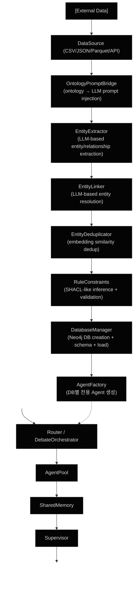
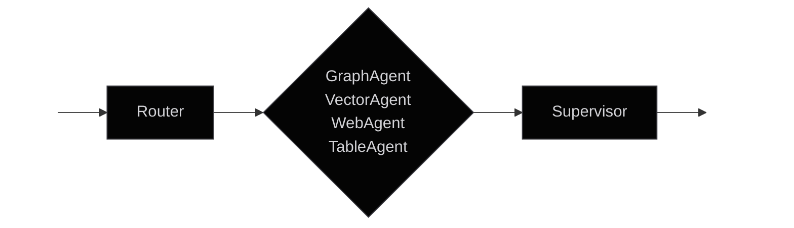
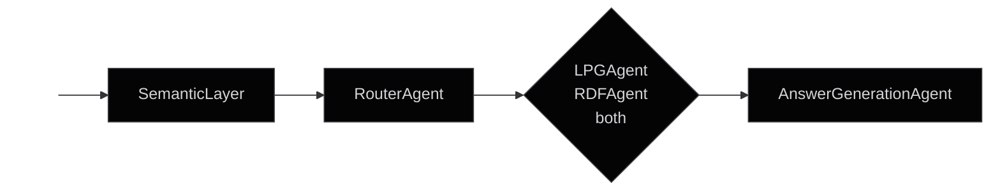
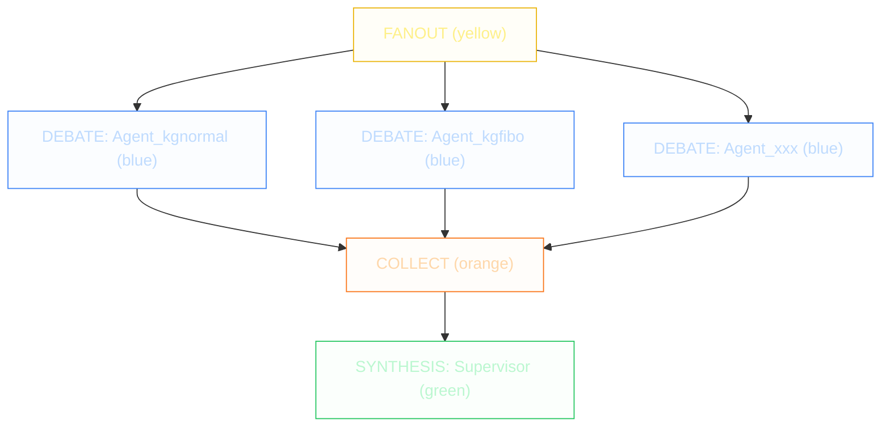

> *Synced automatically from `seocho/docs/ARCHITECTURE.md`*


## Overview

SEOCHO transforms unstructured data into structured Knowledge Graphs. It implements an asynchronous, dynamic Agent Pool architecture leveraging a **Parallel Debate** pattern to answer complex queries against dynamically provisioned databases.

Current baseline:

- Agent runtime: OpenAI Agents SDK
- Trace/evaluation: Opik
- Graph backend: DozerDB (Neo4j protocol compatible)

## Priority Execution Board (2026-02-21)

This board is the active architecture priority order.

### P0: Runtime Contract Stability

- isolate OpenAI Agents SDK calls behind one adapter layer
- enforce contract tests for runner signatures and response payload shape
- block release when strict runtime e2e smoke fails

### P0: Real-Database Agent Provisioning

- only create debate agents for databases that actually exist and are reachable
- expose degraded/partial state in runtime payload when some DB agents are skipped
- keep routing safe when registry includes stale DB names

### P1: Graph Query Durability

- migrate `id(node)` usage to `elementId(node)` contract-safe path
- validate query templates against DozerDB/Neo4j deprecation warnings

### P1: Process Isolation and Health Model

- separate runtime API readiness from batch/notebook pipeline readiness
- split health checks and operational alerts by service role

### P1: Agent Readiness State Machine

- define `ready | degraded | blocked` for each graph agent
- make router/supervisor allocate requests using readiness metadata

### P2: Governance Automation

- enforce `/rules/assess` as promotion gate for rule profile rollout
- expand CI integration checks for ontology artifact and rule export paths

## User Activation Critical Path

Architecture changes are not complete unless users can run this path directly:

1. ingest raw data via `/platform/ingest/raw`
2. ensure semantic index via `/indexes/fulltext/ensure`
3. ask semantic/debate questions via `/api/chat/send`
4. inspect trace and runtime payload in UI
5. pass `make e2e-smoke`

This critical path is the default acceptance gate for user-facing releases.

## Control Plane vs Data Plane

### Control Plane

- agent orchestration and routing policies
- runtime authorization policy enforcement
- deployment quality gates and ADR governance

Primary modules:

- `extraction/agent_server.py`
- `extraction/policy.py`
- `docs/decisions/`

### Data Plane

- data ingestion and extraction pipeline
- SHACL-like rule inference and validation
- graph loading/query execution on DozerDB

Primary modules:

- `extraction/pipeline.py`
- `extraction/rule_constraints.py`
- `extraction/graph_loader.py`

## End-to-End Data Flow



## Query-Time Semantic Flow (New)

For graph QA with hard entity disambiguation requirements:

```mermaid
graph TD
    classDef default fill:#040404,stroke:#3f3f46,stroke-width:1px,color:#d4d4d8;
    classDef agent fill:#ffffff05,stroke:#71717a,stroke-width:1px,color:#fff;
    classDef layer fill:#ffffff10,stroke:#a1a1aa,stroke-width:1px,color:#fff;
    
    Q(("User Question")):::layer --> SL["Semantic Layer<br>- extract question entities<br>- fulltext lookup on DozerDB/Neo4j<br>- semantic dedup/disambiguation with label hints"]:::layer
    SL --> Router["RouterAgent"]:::agent
    Router -->|default| LPG["LPGAgent<br>(property graph neighborhood path)"]:::agent
    Router -->|RDF hints| RDF["RDFAgent<br>(RDF/ontology-oriented path)"]:::agent
    LPG --> Ans["AnswerGenerationAgent<br>(final synthesis)"]:::agent
    RDF --> Ans
```

Why this path exists:

- query-time entity mapping is the hardest failure point in graph QA
- fulltext-first lookup improves recall for imperfect user entity strings
- semantic re-ranking + dedup reduces wrong-node selection before Cypher generation

## Module Map

### Data Ingestion Layer

| Module | File | Purpose |
|--------|------|---------|
| DataSource | `extraction/data_source.py` | ABC + FileDataSource(CSV/JSON/Parquet) + APIDataSource |
| DataCollector | `extraction/collector.py` | Legacy HuggingFace collector (backward compat) |

**Standard record format**: `{"id": str, "content": str, "category": str, "source": str, "metadata": dict}`

### Extraction Layer

| OntologyPromptBridge | `extraction/ontology_prompt_bridge.py` | Converts Ontology YAML definitions → LLM prompt variables |
| EntityExtractor | `extraction/extractor.py` | OpenAI LLM-based entity and relationship extraction |
| EntityLinker | `extraction/linker.py` | LLM-based entity resolution and canonicalization |
| EntityDeduplicator | `extraction/deduplicator.py` | Embedding cosine similarity-based semantic deduplication |
| RuleConstraints | `extraction/rule_constraints.py` | SHACL-like rule inference and node constraint validation annotations |
| PromptManager | `extraction/prompt_manager.py` | Jinja2 prompt templating + history logging |

### Database Layer

| Module | File | Purpose |
|--------|------|---------|
| DatabaseRegistry | `extraction/config.py` | Runtime-extensible DB name allowlist (singleton: `db_registry`) |
| DatabaseManager | `extraction/database_manager.py` | DB provisioning + schema + data loading |
| GraphLoader | `extraction/graph_loader.py` | Neo4j MERGE operations (label-validated) |
| SchemaManager | `extraction/schema_manager.py` | Constraint/index application |

### Agent Layer

| Module | File | Purpose |
|--------|------|---------|
| AgentFactory | `extraction/agent_factory.py` | Dynamically provisions dedicated Agents per database |
| SharedMemory | `extraction/shared_memory.py` | Request-scoped shared memory between agents + query cache |
| DebateOrchestrator | `extraction/debate.py` | Executes Parallel Debate pattern (fan-out → collect → synthesize) |
| Agent Server | `extraction/agent_server.py` | FastAPI endpoints (`/run_agent`, `/run_debate`, `/run_agent_semantic`, `/platform/chat/send`) |
| Platform Agents | `extraction/platform_agents.py` | Backend/Frontend specialist orchestration + session state management |

### Observability Layer

| Module | File | Purpose |
|--------|------|---------|
| Tracing | `extraction/tracing.py` | Opik integration: `configure_opik()`, `wrap_openai_client()`, `@track`, `update_current_span` |
| Config | `extraction/config.py` | `OPIK_URL`, `OPIK_WORKSPACE`, `OPIK_PROJECT_NAME`, `OPIK_ENABLED` |

### UI Layer

| Module | File | Purpose |
|--------|------|---------|
| Platform Server | `evaluation/server.py` | Custom chat frontend backend (proxy + static hosting) |
| Platform UI | `evaluation/static/` | Interactive chat UI (trace + candidate override) |

## Three Execution Modes

### 1. Legacy Router Mode (`POST /run_agent`)



- Legacy static 7-agent pipeline.
- The Router delegates the query to exactly 1 specialist agent.
- Sequential hand-off chain execution.

### 2. Parallel Debate Mode (`POST /run_debate`)


- All database-bound agents execute concurrently via `asyncio.gather()`.
- Each agent stores its isolated conclusion in Shared Memory.
- A Supervisor Agent aggregates and synthesizes the final comprehensive answer.
- Fault Isolated: If one agent fails, the Supervisor synthesizes using the remaining successful agent answers.

### 3. Semantic Graph QA Mode (`POST /run_agent_semantic`)



- 4-agent model aligned with current query-time disambiguation requirement
- semantic layer performs:
  - question entity extraction
  - fulltext index candidate search
  - contains-based fallback search
  - optional ontology-hint alias/label boost from offline artifact (`output/ontology_hints.json`)
  - lightweight semantic dedup/disambiguation
- frontend can pin candidate mappings and resend as `entity_overrides`
- route policy:
  - RDF hints (`rdf`, `owl`, `shacl`, `sparql`) → RDFAgent
  - default → LPGAgent
  - mixed hints → hybrid path (both agents)

## Key Patterns

### DatabaseRegistry (Global Singleton)

```python
from config import db_registry

db_registry.register("mydb01")         # 등록
db_registry.is_valid("mydb01")         # 검증 (True)
db_registry.list_databases()           # 사용자 DB 목록 (system/neo4j 제외)
```

- DB Name Validation: `^[A-Za-z][A-Za-z0-9]*$` (Must start with a letter, alphanumeric only)
- `VALID_DATABASES` (legacy fallback lookup) statically references `db_registry._databases`.

### AgentFactory (Closure-bound Tools)

```python
factory = AgentFactory(neo4j_connector)
agent = factory.create_db_agent("kgnormal", schema_info)
```

- Each agent's `query_db` tool is closure-bound directly to a specific database context.
- Automatic SharedMemory cache integration (via `RunContextWrapper`).

### SharedMemory (Request-scoped)

```python
memory = SharedMemory()
memory.cache_query_result("kgnormal", "MATCH (n) RETURN n", "[...]")
memory.get_cached_query("kgnormal", "MATCH (n) RETURN n")  # cache hit
memory.put("agent_result:kgnormal", "answer text")
memory.get_all_results()  # Supervisor용 전체 결과
```

- Request-scoped: Exactly 1 instance instantiated per API request.
- Implements MD5 hashing on Cypher queries for rapid caching lookups.

### OntologyPromptBridge

```python
from ontology.base import Ontology
from ontology_prompt_bridge import OntologyPromptBridge

ontology = Ontology.from_yaml("conf/schemas/fibo.yaml")
bridge = OntologyPromptBridge(ontology)
context = bridge.render_extraction_context()
# → {"entity_types": "- Organization: ...", "relationship_types": "...", "ontology_name": "FIBO"}
```

- Converts `NodeDefinition` and `RelationshipDefinition` from the Ontology YAML into native LLM prompt variables.
- The `default.yaml` prompt dynamically switches between static mapping vs dynamic logic using standard `` templating blocks.

## Frontend Trace vs Opik

두 시스템의 역할이 명확히 분리되어 있습니다:

### Custom Platform (Interactive UI)
- **Purpose**: Interactive operational chat UX + semantic disambiguation override loop.
- **Location**: `evaluation/server.py` + `evaluation/static/*` (listening on port 8501).
- **Tracing**: The backend streams `trace_steps` and `ui_payload` to the frontend for real-time visualization.
- **Capabilities**: Allows the user to select semantic candidates, trigger override re-queries, and maintains strict session-level dialog history.

### Opik (Production Eval & Trace)
- **Purpose**: Production eval, debugging, LLM scoring, and deep agent visualization.
- **Location**: `http://localhost:5173` (opt-in via `docker compose --profile opik up -d`).
- **Tracing**: `@track` decorators + `wrap_openai_client` trigger automated telemetry → building a native span tree.
- **Capabilities**: Captures parent-child span trees, exact LLM costs/latency, custom datasets & experiments, and prompt scoring metrics.

### Opik Span Tree (Debate Pattern)

Opik에서 Debate 패턴은 다음과 같은 span hierarchy로 표현됩니다:

```
agent_server.run_debate                          [tags: debate-mode]
  └─ debate.run_debate                           [phase: orchestration, agent_count: N]
       ├─ debate.run_single_agent                [phase: fan-out, db: kgnormal]
       │    └─ (OpenAI chat.completions.create)  [auto-traced]
       ├─ debate.run_single_agent                [phase: fan-out, db: kgfibo]
       │    └─ (OpenAI chat.completions.create)  [auto-traced]
       └─ debate.supervisor_synthesis            [phase: synthesis]
            └─ (OpenAI chat.completions.create)  [auto-traced]
```

Each individual recursive span carries heavy `metadata` (e.g., db_name, agent_name, phase) and diagnostic `tags` allowing rapid filtering and auditing within the Opik Dashboard UI.

### Frontend Trace Topology



Edge routing in the UI is rendered strictly via the `metadata.parent` (for the fan-out trajectory) and `metadata.sources` (for the collection synthesis loop) properties on the payload.

## Configuration

### Environment Variables (`.env`)
```
OPENAI_API_KEY=sk-...
NEO4J_URI=bolt://neo4j:7687
NEO4J_USER=neo4j
NEO4J_PASSWORD=password

# Opik (opt-in)
OPIK_VERSION=latest
OPIK_URL=http://opik-backend:8080/api
OPIK_PROJECT_NAME=seocho
```

### Hydra Config (`extraction/conf/`)
```
conf/
├── config.yaml          # Global: model, mock_data, openai_api_key
├── prompts/
│   ├── default.yaml     # Extraction prompt (supports ontology variables)
│   ├── linking.yaml     # Entity linking prompt
│   └── router.yaml      # Router agent prompt
└── schemas/
    ├── baseline.yaml    # kgnormal schema
    ├── fibo.yaml        # kgfibo schema
    └── tracing.yaml     # agent_traces schema
```

## API Endpoints

| Endpoint | Method | Description |
|----------|--------|-------------|
| `/run_agent` | POST | Legacy router mode |
| `/run_agent_semantic` | POST | Semantic entity-resolution flow (Router/LPG/RDF/Answer) |
| `/run_debate` | POST | Parallel debate mode |
| `/indexes/fulltext/ensure` | POST | Ensure fulltext index exists for semantic routing |
| `/platform/chat/send` | POST | Custom interactive platform chat endpoint |
| `/platform/chat/session/{session_id}` | GET | Read platform session history |
| `/platform/chat/session/{session_id}` | DELETE | Reset platform session |
| `/databases` | GET | List registered databases |
| `/agents` | GET | List active DB-bound agents |

Offline helper:

- `scripts/ontology/build_ontology_hints.py` builds `output/ontology_hints.json` from OWL via owlready2.
