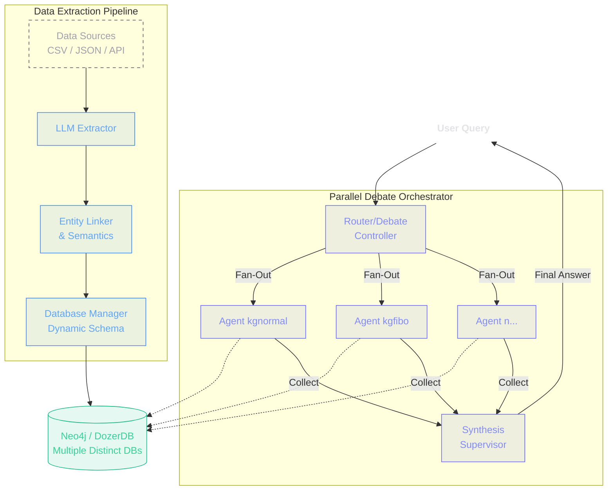

SEOCHO transforms unstructured data into structured knowledge. Below is the full diagram of our agent-driven pipeline.

## The Data Plane

The pipeline revolves around four primary stages:
1. **Extraction (LLM Extractor)**: Consumes flat documents and queries language models using strict ontology schemas to extract structured relationships.
2. **Entity Linking**: Refines the LLM's raw entities by clustering similar descriptions into root identifiers.
3. **Semantic Verification**: Cosine-similarity checks enforce strict deduplication over FAISS embeddings.
4. **Data Management**: Provisions partitioned graph subsets dynamically and inserts the final knowledge representation into a generalized Neo4j host engine.

## The Control Plane

1. **Parallel Debate Fan-Out**: When queries are submitted, the `DebateOrchestrator` fans out the prompt to explicitly isolated sub-agent populations that run concurrently with independent states.
2. **Collection Loop**: The `SharedMemory` interface collates the findings in real-time. 
3. **Synthesis**: The `Supervisor` agent evaluates conflicting conclusions and responds with a single, highly-grounded summary.
