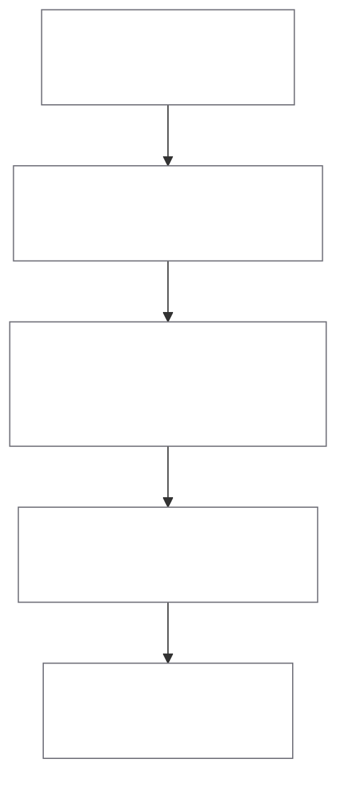

> *Synced automatically from `seocho/docs/WORKFLOW.md`*

This document is the canonical workflow reference for SEOCHO operations.

## Stack Baseline

- Agent runtime: OpenAI Agents SDK
- Tracing/evaluation: Opik
- Graph backend: DozerDB
- MVP tenancy: single-tenant with `workspace_id` propagated end-to-end

## Planes

## Control Plane

Responsibilities:

- agent definitions and routing policy
- runtime authorization policy (app-level RBAC/ABAC)
- deployment, versioning, and quality gates
- decision records (ADRs) and change governance

Primary surfaces:

- `extraction/agent_server.py`
- `extraction/policy.py`
- `docs/decisions/`
- `docs/ADD_PLAYBOOK.md`

## Data Plane

Responsibilities:

- data ingestion from CSV/JSON/API
- extraction, linking, deduplication
- rule inference and validation annotations
- graph load/query execution against DozerDB

Primary surfaces:

- `extraction/pipeline.py`
- `extraction/rule_constraints.py`
- `extraction/data_source.py`
- `extraction/graph_loader.py`

## End-to-End Workflow

1. Intake
- define issue scope and acceptance criteria
- assign `workspace_id`
- capture work item using standardized scripts:
  - `scripts/pm/new-issue.sh`
  - `scripts/pm/new-task.sh`
- confirm philosophy alignment against `docs/PHILOSOPHY.md` (ontology evidence, router/graph mapping, traceability)
- for architecture-significant work, run a panel feasibility review using `docs/PHILOSOPHY_FEASIBILITY_REVIEW.md`

2. Ingestion and graph build
- run extraction pipeline
- apply SHACL-like rule inference/validation
- run readiness check with `/rules/assess` before promoting profile to governance baseline
- save reusable rule profiles (`/rules/profiles`)
- load graph into DozerDB

3. Agent execution
- run `/run_agent` or `/run_debate`
- for query-time entity disambiguation, run `/run_agent_semantic`
- for custom interactive UX, run `/platform/chat/send`
- enforce runtime policy checks
- capture traces in Opik

Semantic path summary:

- semantic layer extracts entities from question
- ensure fulltext index exists (`/indexes/fulltext/ensure`) for target DBs
- fulltext search resolves graph entity candidates
- optional ontology-hint artifact generated offline via `scripts/ontology/build_ontology_hints.py`
- dedup/disambiguation reranks candidates
- router dispatches to LPG or RDF specialist agent
- answer generation agent synthesizes final response

4. Validation and landing
- run code and ops gates
- run runtime flow smoke gate (`make e2e-smoke`) when API/UI/data-plane contracts change
- run quickstart reproducibility check (raw ingest -> semantic/debate chat) before release notes
- run sprint label lint (`scripts/pm/lint-items.sh --sprint <id>`)
- run agent docs lint (`scripts/pm/lint-agent-docs.sh`)
- close issue, rebase, sync, push
- verify branch is up to date with origin

Operational notes:

- use `scripts/pm/lint-items.sh` with internal `bd --no-daemon` execution to avoid local daemon startup stalls.
- current dev quality gates in `Makefile` run against `extraction-service`.
- keep graph procedure privileges scoped (`apoc.*,n10s.*`) in `docker-compose.yml`.

## Docs Website Sync

- source of truth: `README.md` + `docs/*` in this repository
- publish-critical docs for seocho.blog sync:
  - `docs/README.md`
  - `docs/QUICKSTART.md`
  - `docs/ARCHITECTURE.md`
  - `docs/WORKFLOW.md`
- trigger design: push to `main` touching docs paths via `.github/workflows/sync-docs-website.yml`
- action design: `repository_dispatch` (`seocho-docs-sync`) to `tteon/tteon.github.io`
- rollout note: remote activation may be pending until repository owner applies a `workflow`-scoped token (`DOCS_SYNC_TOKEN`)

5. Governance loop
- log architecture decisions as ADRs
- track context graph events and quality metrics
- schedule follow-up issues for unresolved risks
